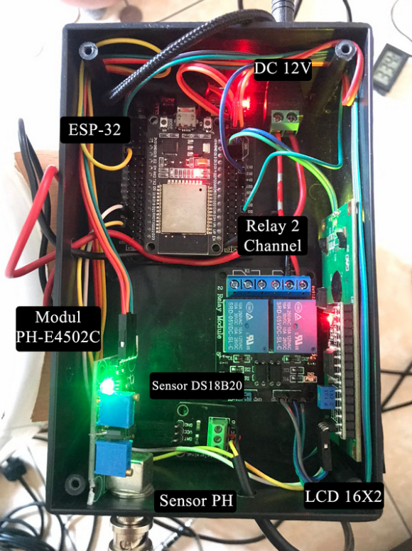

# Smart Aquaculture Monitoring System: Integrating Sensor Technology with Telegram Bot and LCD Display

## Overview

This project is a group assignment for a college course aiming to monitor water temperature, pH levels, fish age, and automate feeding for catfish using sensors - PH-E4502 Library (for pH), DS18B20 Library (for water temperature), and a servo as a fish feeder actuator. Monitoring can be viewed through a Telegram application by joining the created Telegram bot. Additionally, monitoring can be done via an LCD monitor located in the device box.

## Hardware Requirements

-   ESP32 Development Board
-   PH-E4502 Library (Ph) Sensor
-   DS18B20 Library (Water Temperature) Sensor
-   Servo
-   Power Supply
-   Connecting Wires

## Software Requirements

-   Arduino IDE
-   ESP32 Board Support Package
-   ESP32Servo Library
-   WiFi Library
-   Time Library
-   Telegram Bot Library
-   PH-E4502 Library
-   DS18B20 Library

## Installation

1. **Open the Arduino IDE.**

2. **Install the ESP32 Board Support Package.**
3. **Install the required libraries: ESP32Servo, WiFi, time, ArduinoJson, EEPROM, WiFiClientSecure, UniversalTelegramBot, LiquidCrystal_I2C, OneWire, DallasTemperature.**

4. **Connect the hardware components following the [Hardware Setup](#hardware-setup) section.**

5. **Upload the code to your ESP32 board.**

## Library Explanation

-   ESP32Servo.h: Library for controlling servos on the ESP32 platform.
-   WiFi.h: Library for connecting ESP32 to the internet using the WiFi protocol.
-   time.h: Library for accessing and displaying time on the ESP32.
-   ArduinoJson.h: Library for manipulating JSON data on the Arduino platform.
-   EEPROM.h: Library for accessing and managing data on EEPROM (Electrically Erasable Programmable Read-Only Memory).
-   WiFiClientSecure.h: Library for accessing the internet via HTTPS (Secure HTTP) protocol using WiFi client on ESP32.
-   UniversalTelegramBot.h: Library for interacting with Telegram Bot using ESP32.
-   LiquidCrystal_I2C.h: Library for controlling LCD using I2C protocol.
-   OneWire.h: Library required as a dependency for using Dallas Temperature sensor.
-   DallasTemperature.h: Library for reading temperature data from Dallas DS18B20 temperature sensor.

## Flowchart

## Hardware Setup

Follow the steps in the Hardware Setup section of the documentation to properly connect the ESP32, DHT11, and MQ135.

## Usage

1. Power on the system.

2. Open the Arduino IDE Serial Monitor to view real-time data.

3. Access the Telegram bot or Monitoring from LCD

## Monitoring and Control Interface

Visit the Telegram bot integrated with ESP for monitoring, or alternatively, monitoring can be done via the LCD.

## Result

## Contributing

If you'd like to contribute to the project, please follow our [Contribution Guidelines](CONTRIBUTING.md).

## License

This project is licensed under the MIT License.
